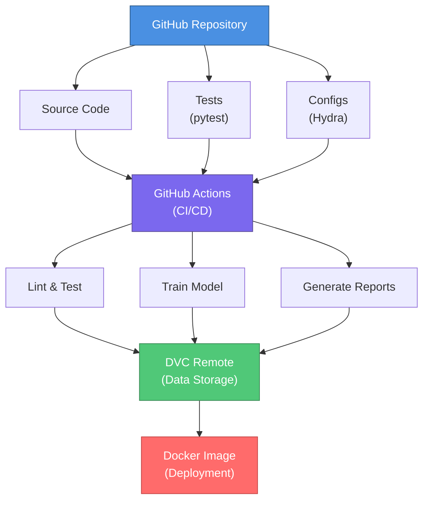

# End-to-End Image Classifier with MLOps

Welcome to the documentation for the End-to-End Image Classifier project! This project demonstrates MLOps best practices for building, training, and deploying image classification models.

## 🎯 Project Overview

This project implements a complete MLOps pipeline for image classification, demonstrating:

- **Standardized Project Structure**: Clean, maintainable codebase following industry standards
- **Configuration Management**: Flexible experiment configuration with Hydra
- **Data Versioning**: Track datasets with DVC
- **Automated Testing**: Comprehensive test suite with pytest
- **CI/CD**: Automated pipelines with GitHub Actions
- **Continuous ML**: Automated model training and reporting with CML
- **Containerization**: Docker support for reproducible deployments
- **Documentation**: Complete documentation with MkDocs

## 🚀 Quick Start

Get started in 3 simple steps:

```bash
# 1. Clone the repository
git clone https://github.com/Hadayxinchao/end-to-end-image-classifier.git
cd end-to-end-image-classifier

# 2. Install dependencies
pip install -r requirements.txt

# 3. Train your first model
python src/training/train.py
```

## 📚 Key Features

### Smart Configuration Management

Use Hydra to manage all configurations without touching code:

```bash
# Override learning rate
python src/training/train.py hyperparameters.learning_rate=0.001

# Use different model
python src/training/train.py model=resnet

# Switch dataset
python src/training/train.py data=mnist
```

### Data Version Control

Never lose track of your datasets:

```bash
# Track data with DVC
dvc add data/raw

# Push to remote storage
dvc push

# Pull data from any commit
git checkout <commit>
dvc pull
```

### Automated Testing

Ensure code quality with comprehensive tests:

```bash
# Run all tests
pytest tests/

# Run with coverage
pytest --cov=src tests/

# Run only fast tests
pytest -m "not slow"
```

### CI/CD Pipeline

Every push triggers:

- ✅ Code linting and formatting checks
- ✅ Unit and integration tests
- ✅ Model training with performance reporting
- ✅ Automated deployment (optional)

### Docker Support

Run anywhere with Docker:

```bash
# Build image
docker build -t image-classifier .

# Run training
docker run image-classifier

# Run inference
docker run image-classifier python src/models/predict.py --help
```

## 📖 Documentation Structure

- **[Getting Started](getting-started/installation.md)**: Installation and setup
- **[User Guide](guide/training.md)**: Learn how to use the project
- **[MLOps](mlops/cicd.md)**: CI/CD and automation details
- **[API Reference](api/data.md)**: Code documentation
- **[Development](development/contributing.md)**: Contributing guidelines

## 🏗️ Project Architecture



## 🎓 Learning Resources

### For Beginners

1. Start with [Installation](getting-started/installation.md)
2. Follow the [Quick Start Guide](getting-started/quickstart.md)
3. Learn about [Configuration](getting-started/configuration.md)

### For MLOps Engineers

1. Understand the [CI/CD Pipeline](mlops/cicd.md)
2. Setup [Data Versioning](mlops/dvc.md)
3. Learn [Docker Deployment](mlops/docker.md)

### For Contributors

1. Read [Contributing Guidelines](development/contributing.md)
2. Review [Testing Practices](development/testing.md)
3. Follow [Code Style Guide](development/code-style.md)

## 🤝 Contributing

We welcome contributions! Please see our [Contributing Guide](development/contributing.md) for details.

## 📝 License

This project is licensed under the MIT License - see the LICENSE file for details.

## 🙏 Acknowledgments

- Cookiecutter Data Science for project structure inspiration
- MLOps community for best practices
- PyTorch team for the deep learning framework

## 📧 Contact

For questions or feedback:

- GitHub Issues: [Report an issue](https://github.com/Hadayxinchao/end-to-end-image-classifier/issues)
- Email: your.email@example.com

---

**Ready to get started?** → [Installation Guide](getting-started/installation.md)
