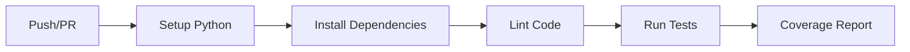
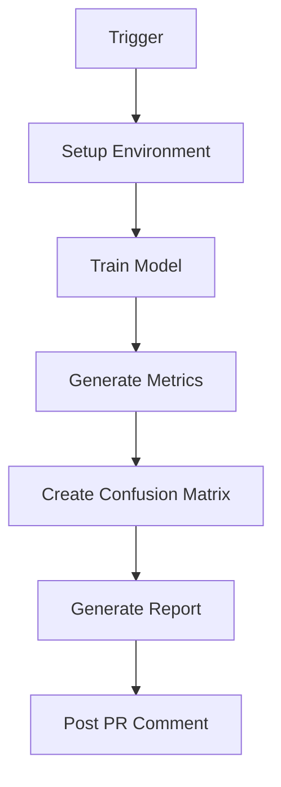

# CI/CD Pipeline

This project uses GitHub Actions for Continuous Integration and Continuous Deployment (CI/CD).

## Overview

The CI/CD pipeline consists of two main workflows:

1. **Tests & Linting** (`tests.yaml`) - Runs on every push and PR
2. **Continuous ML** (`cml.yaml`) - Trains models and generates reports

## Workflow 1: Tests and Linting

### Triggered On

- Push to `main` or `develop` branches
- Pull requests to `main` or `develop`

### What It Does



### Jobs

#### 1. Code Quality Checks

**Flake8** - Syntax and style checking:
```bash
flake8 src tests --max-line-length=135
```

**Black** - Code formatting:
```bash
black --check src tests
```

**isort** - Import sorting:
```bash
isort --check-only src tests
```

**mypy** - Type checking:
```bash
mypy src --ignore-missing-imports
```

#### 2. Unit Tests

Runs all tests across multiple Python versions:

- Python 3.8
- Python 3.9
- Python 3.10

```bash
pytest tests/ -v --tb=short -m "not slow"
```

#### 3. Coverage Report

Generates code coverage and uploads to Codecov:

```bash
pytest tests/ --cov=src --cov-report=xml
```

### Configuration File

`.github/workflows/tests.yaml`:

```yaml
name: CI - Tests and Linting

on:
  push:
    branches: [ main, develop ]
  pull_request:
    branches: [ main, develop ]

jobs:
  test:
    runs-on: ubuntu-latest
    strategy:
      matrix:
        python-version: ["3.8", "3.9", "3.10"]
    # ... (see full file)
```

## Workflow 2: Continuous ML (CML)

### Triggered On

- Push to `main` or `develop`
- Pull requests to `main`

### What It Does



### Steps

1. **Setup Environment**
   - Install Python and dependencies
   - Pull data with DVC (if configured)

2. **Train Model**
   ```bash
   python src/training/train.py \
     hyperparameters=fast \
     hyperparameters.num_epochs=3
   ```

3. **Generate Metrics**
   - Classification report
   - Confusion matrix
   - Training history plots

4. **Create CML Report**
   - Compiles all metrics into markdown
   - Posts as PR comment
   - Uploads artifacts

### Example Report

When you create a PR, CML automatically posts:

```markdown
# Model Training Report

## Training Configuration
- Epochs: 3 (fast config for CI)
- Batch Size: 128
- Dataset: CIFAR-10

## Metrics
```
Classification Report
================================================================================

              precision    recall  f1-score   support

    airplane     0.7234    0.6821    0.7021      1000
  automobile     0.8123    0.7912    0.8016      1000
        bird     0.6234    0.5821    0.6019      1000
...

    accuracy                         0.7234     10000
```

## Confusion Matrix


## Training History

```

### Configuration File

`.github/workflows/cml.yaml`:

```yaml
name: CML - Continuous Machine Learning

on:
  push:
    branches: [ main, develop ]
  pull_request:
    branches: [ main ]

jobs:
  train-and-report:
    runs-on: ubuntu-latest
    steps:
    # ... (see full file)
```

## Setting Up CI/CD

### 1. Enable GitHub Actions

GitHub Actions is enabled by default for public repositories.

For private repos:
1. Go to Settings → Actions → General
2. Enable "Allow all actions and reusable workflows"

### 2. Add Secrets (if needed)

For DVC remote storage or other services:

1. Go to Settings → Secrets and variables → Actions
2. Add secrets:
   - `DVC_REMOTE_URL` (if using DVC)
   - `AWS_ACCESS_KEY_ID` (if using S3)
   - etc.

### 3. Configure DVC Remote (Optional)

If using DVC:

```bash
# Local setup
dvc remote add -d storage s3://mybucket/path

# In GitHub Actions, add secret
# Then modify workflow:
- name: Configure DVC
  env:
    AWS_ACCESS_KEY_ID: ${{ secrets.AWS_ACCESS_KEY_ID }}
    AWS_SECRET_ACCESS_KEY: ${{ secrets.AWS_SECRET_ACCESS_KEY }}
  run: dvc pull
```

## Customization

### Modify Test Configuration

Edit `.github/workflows/tests.yaml`:

```yaml
# Change Python versions
strategy:
  matrix:
    python-version: ["3.9", "3.10", "3.11"]

# Add more lint checks
- name: Run pylint
  run: pylint src
```

### Modify CML Configuration

Edit `.github/workflows/cml.yaml`:

```yaml
# Train for more epochs
- name: Train model
  run: |
    python src/training/train.py \
      hyperparameters.num_epochs=10
```

### Add More Jobs

```yaml
deploy:
  needs: test
  runs-on: ubuntu-latest
  if: github.ref == 'refs/heads/main'
  steps:
    - name: Deploy model
      run: |
        # Your deployment script
```

## Badges

Add status badges to your README:

```markdown


[](https://codecov.io/gh/username/repo)
```

## Monitoring

### View Workflow Runs

1. Go to the "Actions" tab in your repository
2. Click on a workflow run to see details
3. View logs for each job

### Check Coverage

If you set up Codecov:
- Visit `https://codecov.io/gh/username/repo`
- View coverage trends and reports

## Best Practices

1. **Keep CI Fast**
   - Use fast config for CI
   - Cache dependencies
   - Run slow tests separately

2. **Fail Fast**
   - Run linting before tests
   - Use `continue-on-error: false` for critical jobs

3. **Artifact Management**
   - Upload trained models
   - Save reports for later review
   - Use appropriate retention days

4. **Security**
   - Never commit secrets
   - Use GitHub Secrets
   - Limit workflow permissions

## Troubleshooting

### Tests Failing Locally But Passing in CI

- Check Python version
- Clear cache: `pip cache purge`
- Check for environment-specific code

### CML Report Not Appearing

- Check GitHub token permissions
- Verify CML installation
- Check workflow logs

### Out of Memory in CI

- Reduce batch size in fast config
- Use smaller model
- Request more resources

## Advanced Topics

### Matrix Strategy

Test multiple configurations:

```yaml
strategy:
  matrix:
    python-version: [3.8, 3.9, 3.10]
    os: [ubuntu-latest, windows-latest, macos-latest]
```

### Caching

Speed up workflows with caching:

```yaml
- uses: actions/cache@v3
  with:
    path: ~/.cache/pip
    key: ${{ runner.os }}-pip-${{ hashFiles('**/requirements.txt') }}
```

### Scheduled Runs

Run tests nightly:

```yaml
on:
  schedule:
    - cron: '0 0 * * *'  # Every day at midnight
```

## Learn More

- [GitHub Actions Documentation](https://docs.github.com/en/actions)
- [CML Documentation](https://cml.dev/)
- [Codecov Documentation](https://docs.codecov.com/)
